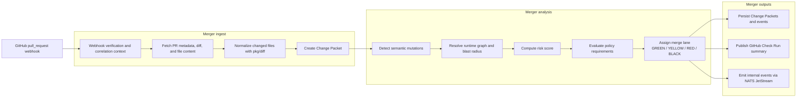

<p align="center">
  
</p>

<p align="center">
  <a href="https://github.com/devr-tools/merger/actions/workflows/ci.yml"></a>
  <a href="https://github.com/devr-tools/merger/actions/workflows/cd.yml"></a>
  <a href="https://github.com/devr-tools/merger/releases">
    
  </a>
  <a href="https://pkg.go.dev/github.com/devr-tools/merger/pkg/merger">
    
  </a>
  <a href="https://goreportcard.com/report/github.com/devr-tools/merger">
    
  </a>
  <a href="LICENSE"></a>
  <a href="https://www.linkedin.com/in/alxjohn">
    
  </a>
</p>

# merger

`merger` is a Go-native mutation control plane and CLI for AI-native engineering
organizations. It turns a pull request diff into a structured **Change Packet** —
classifying semantic mutations, estimating blast radius and rollout risk, applying
policy, and assigning a **merge lane** that reflects how a change should safely
propagate.

It is not a code review bot. The design center is operational coordination at a
scale where autonomous agents generate more software mutations than humans can
inspect by hand.

**Contents:** [What it does](#what-it-does) · [Install](#install) · [Quickstart](#quickstart) · [SDK](#sdk) · [Merge lane model](#merge-lane-model) · [Change Packet flow](#change-packet-flow) · [Open-source shape](#open-source-shape) · [Docs](#docs)

## What it does

- parses a PR diff into normalized changed files
- detects semantic mutations from path rules, patch signals, and structured analyzers
- resolves a runtime graph and estimates blast radius from topology hints and `CODEOWNERS`
- computes a weighted risk score and a policy decision from composable YAML rules
- assigns a merge lane — `GREEN`, `YELLOW`, `RED`, or `BLACK`
- runs the same pipeline three ways: offline CLI, embeddable SDK, and a full control plane

## Install

Recommended (Go):

```bash
go install github.com/devr-tools/merger/cmd/merger@latest
merger version
```

Other install paths:

- GitHub Releases: tagged archives for direct download
- Homebrew: `brew install devr-tools/tap/merger`
- GitHub Marketplace Action: `Devr Merger`
- Source build: `make build`

Full setup — including the local control plane, toolchain bootstrap, and the
GitHub Action — lives in [docs/getting-started.md](docs/getting-started.md).

## Quickstart

The CLI runs the analysis pipeline offline — no services, database, or event bus
required — so you can classify a diff and preview its merge lane from a laptop or
a CI job:

```bash
merger init                       # scaffold .merger/ config + policy
merger validate                   # check config and policy resolve
merger scan -base-ref origin/main # analyze the diff vs a base ref
merger scan -diff change.diff -format json
merger scan -base-ref origin/main -explain # show rationale and mitigations
```

`merger scan` parses a unified diff (from `-diff <file|->` or a `-base-ref <ref>`
git range), runs mutation detection, runtime-graph, risk, policy, and lane
assignment, and prints a report (`-format text|json`). Pass `-fail-on-lane RED`
to exit non-zero when a change lands in a given lane or higher — a ready-made CI
gate.

Use `-explain` with text output to include policy rationale, scored risk
contributors, mitigations, affected services, and runtime notes.

Configuration is auto-discovered from `merger.yaml` or `.merger/merger.yaml`.
`merger mcp` serves the same analysis as agent tools over the Model Context
Protocol (stdio) — see [docs/mcp.md](docs/mcp.md).

## SDK

The offline pipeline is available as a library from
`github.com/devr-tools/merger/pkg/merger`:

```go
package main

import (
	"context"
	"fmt"

	"github.com/devr-tools/merger/pkg/merger"
)

func main() {
	packet, err := merger.Scan(context.Background(), merger.ScanOptions{
		Diff:  rawUnifiedDiff,
		Lanes: merger.DefaultLanes(),
	})
	if err != nil {
		panic(err)
	}
	fmt.Println(packet.MergeLane)
}
```

Load a policy rule set with `merger.LoadPolicy(path)` and pass it as
`ScanOptions.Policy`. See [docs/sdk.md](docs/sdk.md).

## Merge lane model

- `GREEN` — isolated, low-risk mutation with required automated evidence satisfied and no mandatory human escalation.
- `YELLOW` — standard review path.
- `RED` — high-risk or owner/security-gated change.
- `BLACK` — blocked; decomposition, rework, or policy exception required.

Policies are YAML and intentionally composable:

```yaml
policies:
  - name: auth_requires_security_review
    when:
      mutations:
        - auth_behavior_change
    require:
      reviewers:
        - security
      evidence:
        - auth_integration_tests
      deployment:
        strategy: canary
        requires_canary: true
    action:
      minimum_lane: RED
```

## Change Packet flow



See [docs/flows/github-webhook-flow.md](docs/flows/github-webhook-flow.md) for
the detailed flow and [docs/examples/change-packet.json](docs/examples/change-packet.json)
for a sample Change Packet.

## Open-source shape

merger is built as an open-source platform core. The repository ships first-party
implementations for GitHub, NATS, and PostgreSQL, but the extension seams are
public so other organizations can plug in their own SCM systems, topology sources,
event backbones, analyzers, and persistence adapters. See
[docs/extending-merger.md](docs/extending-merger.md) for the current extension
surface.

## Docs

- [Getting started](docs/getting-started.md)
- [SDK guide](docs/sdk.md)
- [MCP server](docs/mcp.md)
- [Extending merger](docs/extending-merger.md)
- [GitHub webhook flow](docs/flows/github-webhook-flow.md)
- [Release automation](docs/release-automation.md)
- [Contributing](CONTRIBUTING.md)
- [Security](SECURITY.md)

---

<p align="center">
  <sub>Apache 2.0 · part of the <a href="https://github.com/devr-tools">devr-tools</a> suite</sub>
</p>
