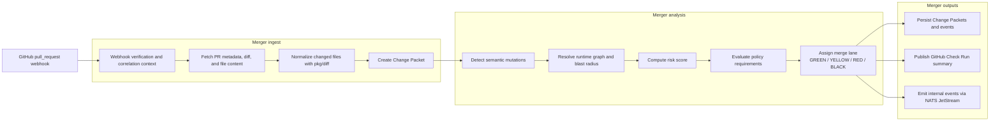

<p align="center">
  
</p>

# Merger

Merger is a mutation control plane for AI-native engineering organizations. It converts pull requests into structured Change Packets, classifies semantic mutations, estimates blast radius and rollout risk, applies policy, and assigns a merge lane that reflects how changes should safely propagate.

It is not a code review bot. The design center is operational coordination at a scale where autonomous agents can generate more software mutations than humans can inspect manually.

## Open-Source Shape

Merger is being built as an open-source platform core. The repository includes first-party implementations for GitHub, NATS, and PostgreSQL, but the extension seams are public so other organizations can plug in their own SCM systems, topology sources, event backbones, analyzers, and persistence adapters.

See [docs/extending-merger.md](/Users/alex/Documents/GitHub/merger/docs/extending-merger.md:1) for the current extension surface.

## Phase 1 Foundation

This repository scaffolds the first production-oriented control plane slice:

- GitHub webhook ingest
- PR diff parsing
- Change Packet generation
- Rule-based semantic mutation detection
- Risk scoring
- Merge lane assignment
- YAML-backed policy evaluation
- GitHub Check Run publishing abstraction
- Internal event bus abstraction
- Structured logging and trace-ready instrumentation

## CLI

The `merger` CLI is the local, installable face of the control plane. It runs
the same analysis pipeline offline — no services, database, or event bus
required — so you can classify a diff and preview its merge lane from a laptop
or a CI job.

```bash
go install github.com/devr-tools/merger/cmd/merger@latest

merger init                       # scaffold .merger/ config + policy
merger validate                   # check config and policy resolve
merger scan -base-ref origin/main # analyze the diff vs a base ref
merger scan -diff change.diff -format json
```

`merger scan` parses a unified diff (from `-diff <file|->` or a
`-base-ref <ref>` git range), runs mutation detection, runtime-graph, risk,
policy, and lane assignment, and prints a report (`-format text|json`). Pass
`-fail-on-lane RED` to exit non-zero when a change lands in a given lane or
higher — useful as a CI gate.

Configuration is auto-discovered from `merger.yaml` or `.merger/merger.yaml`
(see [internal/cli](/Users/alex/Documents/GitHub/merger/internal/cli:1) and the
offline pipeline in [internal/scan](/Users/alex/Documents/GitHub/merger/internal/scan/scan.go:1)).

## SDK

The same offline pipeline is available as a library from
`github.com/devr-tools/merger/pkg/merger`:

```go
package main

import (
	"context"
	"fmt"

	"github.com/devr-tools/merger/pkg/merger"
)

func main() {
	packet, err := merger.Scan(context.Background(), merger.ScanOptions{
		Diff:  rawUnifiedDiff,
		Lanes: merger.DefaultLanes(),
	})
	if err != nil {
		panic(err)
	}
	fmt.Println(packet.MergeLane)
}
```

Load a policy rule set with `merger.LoadPolicy(path)` and pass it as
`ScanOptions.Policy`. See [docs/sdk.md](docs/sdk.md).

## Architecture

The repository is organized around domain boundaries instead of a single service package:

- `cmd/merger-ingest`: HTTP ingress for GitHub pull request webhooks.
- `cmd/merger-controlplane`: control-plane process for downstream orchestration and subscriptions.
- `internal/domain`: strongly typed core models such as `ChangePacket`, `Mutation`, `Risk`, and `PolicyDecision`.
- `internal/ingest`: request handling and Change Packet assembly.
- `internal/mutations`: semantic mutation engine and signal extractors.
- `internal/risk`: weighted risk scoring and risk summary generation.
- `internal/policy`: YAML-backed policy evaluation.
- `internal/lanes`: merge lane assignment.
- `internal/runtimegraph`: runtime graph contracts and pluggable topology sources.
- `internal/github`: GitHub App auth, webhook verification, PR/diff fetch, file content fetch, and check publishing.
- `internal/events`: async-friendly event bus abstraction with memory and NATS JetStream implementations.
- `internal/store`: PostgreSQL-backed persistence for Change Packets and emitted events.
- `internal/bootstrap`: provider construction for first-party adapters.
- `internal/telemetry`: structured logging, correlation IDs, and trace-ready interfaces.
- `pkg/diff`: unified diff parsing reusable across services.
- `pkg/merger`: public aliases for core MergeR types.
- `pkg/extensions`: public provider interfaces for open-source extension.
- `tests/`: black-box and package-level tests kept separate from source packages.

## Merge Lane Model

- `GREEN`: isolated, low-risk mutation with automated evidence and no mandatory human escalation.
- `YELLOW`: standard review path.
- `RED`: high-risk or owner/security-gated change.
- `BLACK`: blocked; decomposition, rework, or policy exception required.

## Change Packet Flow



1. GitHub sends a `pull_request` webhook.
2. The ingest service creates a correlation-aware processing context.
3. Pull request metadata, diff, and file content are fetched through the GitHub App adapter.
4. The diff parser produces normalized changed files.
5. The mutation engine combines path rules, patch signals, and AST/structured analyzers.
6. Runtime graph sources ingest topology hints such as deploy manifests and `CODEOWNERS`.
7. The risk engine computes risks and an aggregate risk score.
8. The policy engine resolves reviewers, evidence, deployment constraints, and blockers.
9. The lane assigner selects `GREEN`, `YELLOW`, `RED`, or `BLACK`.
10. Change Packets and event envelopes are persisted in PostgreSQL.
11. A GitHub Check Run summary is published and internal events are emitted through NATS JetStream.

See [docs/flows/github-webhook-flow.md](/Users/alex/Documents/GitHub/merger/docs/flows/github-webhook-flow.md:1) for the detailed flow and [docs/examples/change-packet.json](/Users/alex/Documents/GitHub/merger/docs/examples/change-packet.json:1) for a sample Change Packet.

## Policy Example

Policies are YAML and intentionally composable:

```yaml
policies:
  - name: auth_requires_security_review
    when:
      mutations:
        - auth_behavior_change
    require:
      reviewers:
        - security
      evidence:
        - auth_integration_tests
      deployment:
        strategy: canary
        requires_canary: true
    action:
      minimum_lane: RED
```

## Local Development

Merger now requires Go `1.25.10` for local development and CI. That upgrade is part of the security baseline, not an optional tooling preference.

Bootstrap the expected toolchain into your shell before running repo commands:

```bash
eval "$(./scripts/dev/use-go-1.25.10.sh)"
go version
```

That helper installs the `go1.25.10` launcher if needed, downloads the toolchain into `$HOME/sdk/go1.25.10`, and exports `GOROOT`, `PATH`, and `GO` for the current shell.

After that one-time install, plain `make` targets will automatically prefer `$HOME/sdk/go1.25.10/bin/go` when it exists, so `make ci` does not depend on your shell defaulting to the right Go version.

Use the provided compose stack for platform dependencies:

```bash
make compose-up
make run-ingest
make run-controlplane
```

Default services:

- Ingest HTTP: `:8080`
- Control-plane HTTP: `:8081`
- Control-plane gRPC: `:9091`
- PostgreSQL: `:5432`
- Redis: `:6379`
- NATS: `:4222`

Suggested verification:

```bash
make verify
```

## Near-Term TODOs

- Add Kafka and non-GitHub SCM providers to validate the public extension model.
- Expand runtime graph ingestion from service catalogs, deployment systems, and ownership registries.
- Add analyzer SDK examples for out-of-tree semantic detectors.
- Introduce replay workers and outbox-based delivery guarantees.
- Learn policy weights and lane thresholds from deploy outcomes and incident history.
- Upgrade generated protobuf plugins in lockstep with future gRPC releases.
